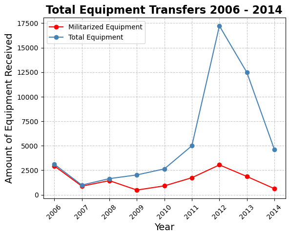
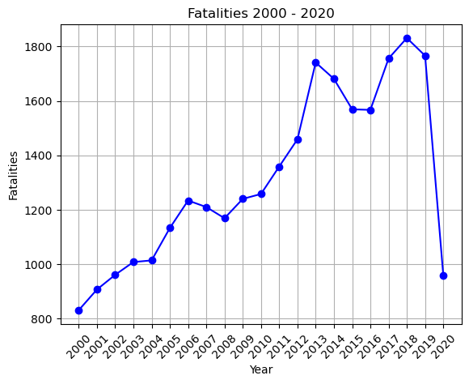
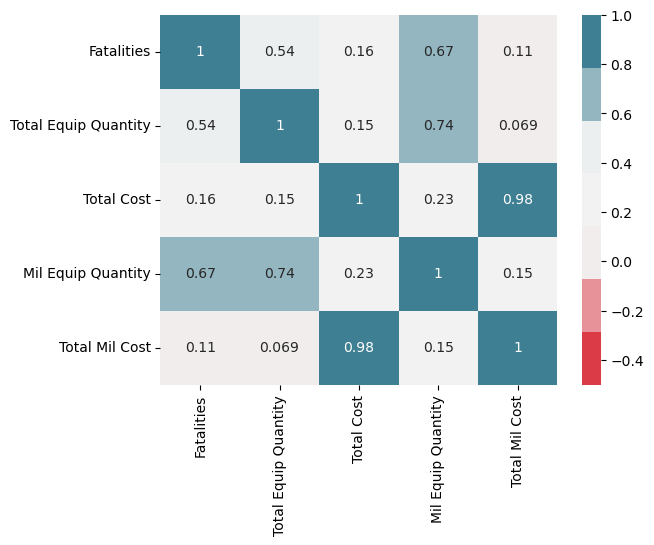

# Data Analysis of 1033 Program Impacts

## Background

The 1033 Program is a U.S. Department of Defense initiative that allows the transfer of surplus military equipment to state and local law enforcement agencies. This equipment includes items such as armored vehicles, weapons, aircraft, and tactical gear.
The program was established by Congress in 1997 as part of the National Defense Authorization Act. Its original purpose was to provide law enforcement agencies with access to equipment that they might not otherwise be able to afford, enhancing their ability to combat crime and respond to emergencies.
However, the 1033 Program has been the subject of controversy for several reasons:

1. Militarization of Police: Critics argue that the program contributes to the militarization of police forces, blurring the line between military and civilian law enforcement. They are concerned that the use of military equipment by police creates an adversarial relationship with the communities they serve and can lead to excessive force and violations of civil liberties.

2. Lack of Oversight: There have been concerns about the lack of oversight and accountability in the program. Some law enforcement agencies have been found to misuse or lose track of the military equipment they receive, leading to questions about how it is being used and whether it is necessary.

3. Use in Civil Unrest: The deployment of military-style equipment by police during protests and civil unrest has raised concerns about the chilling effect on free speech and the right to assemble peacefully. Critics argue that the use of such equipment can escalate tensions and provoke violence.

4. Racial Bias: There are concerns that the 1033 Program disproportionately affects communities of color, who are more likely to be subjected to aggressive policing tactics. Critics argue that the program exacerbates existing racial disparities in law enforcement and contributes to racial profiling and discrimination.

In recent years, there have been calls for reforms to the 1033 Program, including increased transparency, accountability, and restrictions on the types of equipment that can be transferred to law enforcement agencies. Some advocates have called for the program to be abolished altogether, arguing that it undermines community trust in law enforcement and perpetuates a culture of violence.

I wanted to look at publicly available 1033 Program data from the Defense Logistics Agency to understand what types of surplus equipment Law Enforcement agencies were really receiving and determine how the amounts of surplus equipment impacted police brutality, specifically fatal encounters with police and LE agencies.

## Exploratory Data Analysis

For this analysis I merged 2 datasets:

### 1033 FOIA Dataset

The 1033 dataset was publicly available and was obtained thru a FOIA request. The dataset date range was from 2006 to 2014 had 243,492 rows and 8 columns. However, each item had a "Quantity" column which indicated that the true amount of surplus equipment transfered to LE was much greater than 243,000 items.

The link to the dataset can be found here: (https://data.world/gene/military-surplus-2014-police)

### Fatal Encounters with Police Dataset

The Fatal Encounters dateset collected data from 2000 to 2020 and had 28,335 rows and 29 columns. The dataset recorded all fatal encounters with Law Enforcement and even provided details about the cause of death.

The link to the dataset can be found here: (https://www.kaggle.com/datasets/djonafegnem/police-fatalities-in-the-us-from-2000-to-2020)

### Equipment Transfers to Law Enforcement

This graph shows the amount of surplus equipment transfered to LE from 2006 and 2014. The blue line shows the total amount and the red line shows the amount of militarized equipment that was transfered. Interestingly, there is a peak in transfers in 2012.

Because the 1033 program transfers surplus DoD equipment ranging from office supplies to grenade launchers, I filtered out the list of equipment in the 1033 dataset to only include equipment that is considered "militarized" from these categories:

- Vehicles
- Weapons
- Tactical Gear

### Total Amount of Fatal Encounters with Law Enforcement

### Top States and Counties with High Numbers of Militarized Equipment and High Instances of Fatal Encounters with Police

## Predictive Modeling

### Hypothesis Testing

### Correlations

### Linear Regression 
