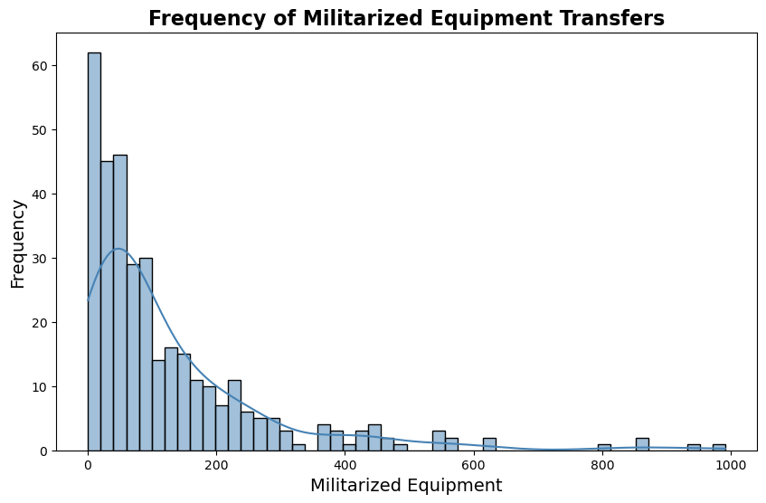
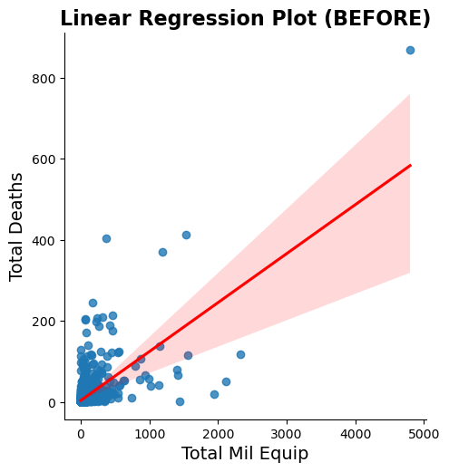
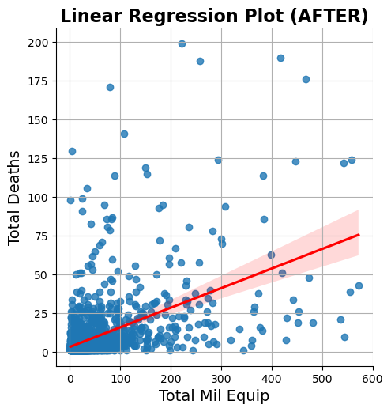

# Data Analysis of 1033 Program Impacts

## Background

The 1033 Program is a U.S. Department of Defense initiative that allows the transfer of surplus military equipment to state and local law enforcement agencies. This equipment includes items such as armored vehicles, weapons, aircraft, and tactical gear.
The program was established by Congress in 1997 as part of the National Defense Authorization Act. Its original purpose was to provide law enforcement agencies with access to equipment that they might not otherwise be able to afford, enhancing their ability to combat crime and respond to emergencies.
However, the 1033 Program has been the subject of controversy for several reasons:

1. Militarization of Police: Critics argue that the program contributes to the militarization of police forces, blurring the line between military and civilian law enforcement. They are concerned that the use of military equipment by police creates an adversarial relationship with the communities they serve and can lead to excessive force and violations of civil liberties.

2. Lack of Oversight: There have been concerns about the lack of oversight and accountability in the program. Some law enforcement agencies have been found to misuse or lose track of the military equipment they receive, leading to questions about how it is being used and whether it is necessary.

3. Use in Civil Unrest: The deployment of military-style equipment by police during protests and civil unrest has raised concerns about the chilling effect on free speech and the right to assemble peacefully. Critics argue that the use of such equipment can escalate tensions and provoke violence.

4. Racial Bias: There are concerns that the 1033 Program disproportionately affects communities of color, who are more likely to be subjected to aggressive policing tactics. Critics argue that the program exacerbates existing racial disparities in law enforcement and contributes to racial profiling and discrimination.

In recent years, there have been calls for reforms to the 1033 Program, including increased transparency, accountability, and restrictions on the types of equipment that can be transferred to law enforcement agencies. Some advocates have called for the program to be abolished altogether, arguing that it undermines community trust in law enforcement and perpetuates a culture of violence.

I wanted to look at publicly available 1033 Program data from the Defense Logistics Agency to understand what types of surplus equipment Law Enforcement agencies were really receiving and determine how the amounts of surplus equipment impacted police brutality, specifically fatal encounters with police and LE agencies.

My Minimum Viable Product is to determine if there is a linear relationship between the amounts of militarized equipment in a county and the amounts of deaths in that county due to intentional use of force. I aim to be able to provide a threshold for 1033 program auditors to use to begin auditing counties' Law Enforcement agencies.

## Exploratory Data Analysis

For this analysis I merged 2 datasets based on the County and State. 

### 1033 FOIA Dataset

The 1033 dataset was publicly available and was obtained thru a FOIA request. The dataset date range was from 2006 to 2014 had 243,492 rows and 8 columns. However, each item had a "Quantity" column which indicated that the true amount of surplus equipment transfered to LE was much greater than 243,000 items.

The link to the dataset can be found here: (https://data.world/gene/military-surplus-2014-police)

### Fatal Encounters with Police Dataset

The Fatal Encounters dateset collected data from 2000 to 2020 and had 28,335 rows and 29 columns. The dataset recorded all fatal encounters with Law Enforcement and even provided details about the cause of death.

The link to the dataset can be found here: (https://www.kaggle.com/datasets/djonafegnem/police-fatalities-in-the-us-from-2000-to-2020)

### Equipment Transfers to Law Enforcement

This graph shows the amount of surplus equipment transfered to LE from 2006 and 2014. The blue line shows the total amount and the red line shows the amount of militarized equipment that was transfered. Interestingly, there is a peak in transfers in 2012.

Because the 1033 program transfers surplus DoD equipment ranging from office supplies to grenade launchers, I filtered out the list of equipment in the 1033 dataset to only include equipment that is considered "militarized" from these categories:

- Vehicles
- Weapons
- Tactical Gear

Though there are many items of equipment transfered to LE agencies through the 1033 program, we can see from the histogram below that it is rare for a county to have more than 250 items of militarized equipment from a 1033 transfer.  

### Total Amount of Fatal Encounters with Law Enforcement

This graph depcits the total amount of fatalities caused by intentional use of force from 2000 - 2020. For the remainder of my analysis, I only used data from this data set from 2006 - 2020 in order to accurately analyze fatalities in counties after they received 1033 equipment. 

I assess the drop in fatalities in 2020 is due to the COVID-19 pandemic. Perhaps increased scrutiny of police brutatlity during the summer of 2020 also impacted the amount of fatalities that year.

### Top States and Counties with High Numbers of Militarized Equipment and High Instances of Fatal Encounters with Police

## Predictive Modeling

### Hypothesis Testing
Null Hypothesis: Counties with militarized equipment have similar fatality rates as counties with no militarized equipment.

Alternate Hypothesis: Counties with militarized equipment have HIGHER fatality rates as counties with no militarized equipment.

Based on the p_value of 2.6589072089593097e-06, we reject the null hypothesis.

### Correlations

Based on the correlation heatamp below, I decided to create a linear regression model to determine if there was a linear relationship between the amount of militarized equipment a county had and the amount of fatalities in that county. 

### Linear Regression 

When looking at the whole dataset, there is a linear relationship between the amount of militarized equipment as the independent variable and the number of fatalities as the dependent variable, but the large amount of viariance in the model is evident. Using this subset of data, I got an R^2 value of 0.66 and a Mean Squared Error value of 916.19.

 

Even after scoping the dataset to cut out counties such as Cook County, IL (Chicago) and remove counties that had no instances of fatalities or transfers of militarized equipment, the model still did not fit well. Using this subset of data, I acheived an R^2 value of 0.317 and a Mean Squared Error value of 156.59.

### Predictions
Despite not having a linear relationship, I did model a prediction to provide DLA/DoD auditors with a minimum threshold amount of militarized equipment in a county that should warrant an audit. 

My prediciton model used the data from the "AFTER" linear regression model showed above because I thought it was important to base predictions off of the scoped in data to provide a relatively sound recommendation. The model shows that counties with over 30 pieces of 1033-supplied militarized equipment theoretically have over 7 fatalities in that county which would place that county in the 75th percentile of all counties. Therefore, I recommend that at a minimum, the 1033 program enact audits starting at this threshold to increase oversight and provide increased transperancy. 
